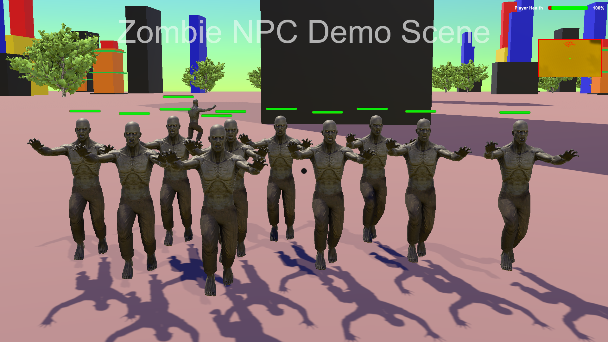
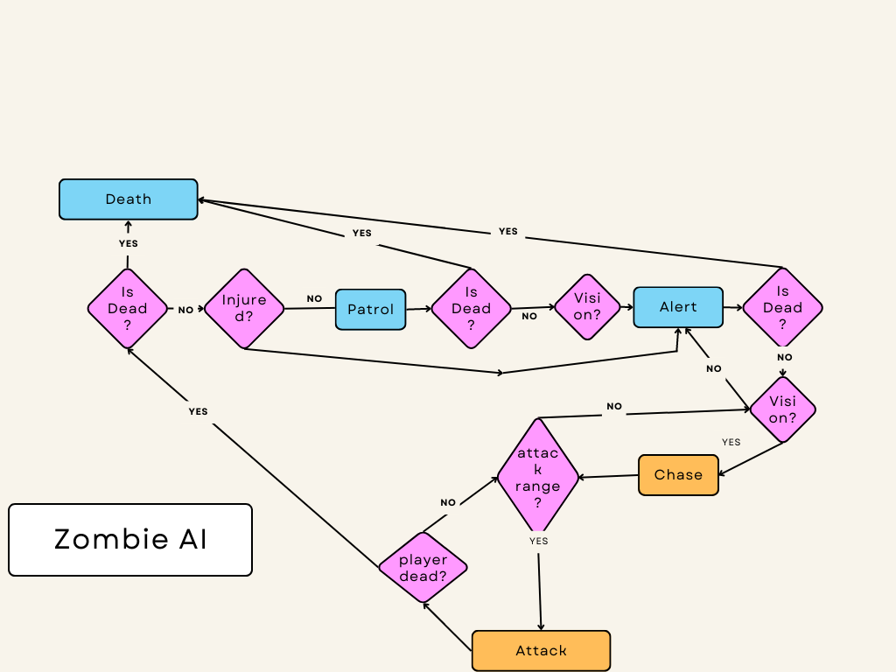
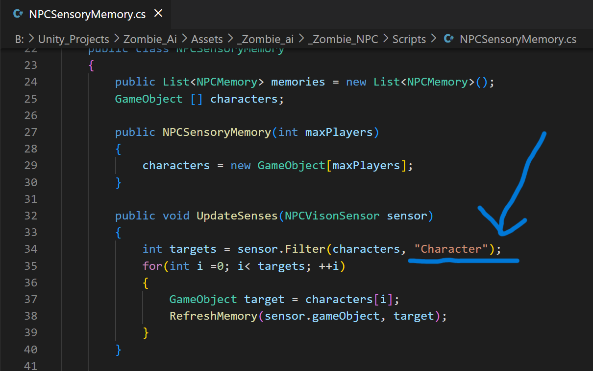

# Zombie NPC or Zombie AI for Unity Game Engine

* A Fully State Machine and ~Behavior Tree~  controlled advanced Zombie Non Playable Character or AI for Unity Project with a Demo Scene.

See 
* [Demo for 2.0.0](https://www.youtube.com/watch?v=JxbXT3MU_9M), 

* [Demo for 1.0.0](https://www.youtube.com/watch?v=486w7NuyBWo).

* Download : [v2.3.2-stable](https://github.com/baponkar/zombie-ai/releases/tag/v2.3.3)

It has roughly following Characteristics:

- [x] Zombie - Idle State.
- [x] Zombie - Chasing Player  State
- [x] Zombie - Patrolling State
- [x] Zombie - Attack State
- [x] Zombie - Flee State
- [x] Zombie  - Dead State
- [x] Zombie State - Waypoint based Patrolling. 
- [x] Zombie - Call Near NPC to attack Player
- [ ] ~State Control by Behavior Tree~
- [x] Statemachine[Both prefab have]
- [x] Zombie - Sound Sensor
- [x] Zombie - Vison Sensor
- [x] Sensor Memory for Target
- [x] FPS Player
- [x] A Demo Scene
- [x] Walking Audio 
- [x] Camera Shake

## 
## 
## 

## Behavior Tree
## 
## 

## Documentation :
* This is a complete Unity Project with included depending assets and also included a Demo Scene.

* If You download this project and  open it with Unity then it may works perfectly but sometimes may not works the way because of layers absence in the project then you need to add  corresponding layers and set by the below instruction.

* If you use this project with your old project then first put '_Zombie_ai_Fsm' folder in your project then create and add the layers in your project by below instruction.
Zombie NPC is a navmesh agent which detect player by using vision sensor and sound sensor.Vison Sensor have a sensory memory to memorize sense which can be set by config scriptable object.

* vison sensor can sense **Character** layers which is attached to the player prefab.

* The NPC Zombie have different inter related states you can manage those states by set up in config scriptable object found in the project.

* Project setup instructions:
---
1. Add following layers in the following orders 

- [x] Layer 3 - **Player**
- [x] Layer 6 - **NPC**
- [x] Layer 13 - **Character**
- [x] Layer 14 - **Mini Map**

2. NPC  : Change Default layer of  Zombie/Romero Prefab into **NPC**, and also
 Change Tag  of  Zombie/Romero Prefab into **NPC**.

3. Change Layer of **Player** into **Character** which will be seen by NPCs, and also
Change Tag of **Player** with "**Player**".

4. Change Layer of all prefabs **indicator plane** into "**Mini Map**" Layer.Which will be seen only by Mini Map Camera.

5. See **NPCVisionSensor** Script which attached with npcs i.e. zombie/Romero prefabs and change its **Occulation Layer** with corresponding
**Ground Layer** i.e. if ground plain be **Defult** then change into **Defult** Layer.

6. See NPCVisionSensor.cs Script which attached with npcs i.e. zombie/Romero prefabs and change its **Target Layer** into **Character** Layer which is the Layer of Player.So NPCs can see the player by vision sensor.

7. Bake Navmesh with Humanoid Agent which should be in NavMeshAgent(Which attached to the Zombie Prefab).

8. Now put zombie prefab and player prefab in your scene.Player has attached a Health script which is damageable by Zombie/Romero.

9. Zombie also has attached a Health Script which can be damagable by external player which has a weapon which can be used to damage zombies health.

10. Change or tweak zombie behavior by setting up zombie config scriptable object.

11. To Change custom sensor detection layer edit 'NPCSensoryMemory.cs' file

12. If you don't see the npcs then you need to add 'NPC' layer into the culling mask section of FPSCamera which have attached to theplayer prefab

## Zombie sensor sense *Character* Layer for this NPCSensoryMemory.cs Script.

* This Project has a Demo Scene with necessary setup.
## License:
* [GNU GPL v-3.0 License](LICENSE.md)
But you are requested to see the delendency assets licences.

## Credits :
1. I have get ideas from  Youtuber 'Kiwi Coder's  tutorials
   [1](https://www.youtube.com/watch?v=znZXmmyBF-o&t=629s)
   [2](https://www.youtube.com/watch?v=1H9jrKyWKs0)

3. I have get ideas from  Youtuber ['Dev/GameDevelopment'](https://www.youtube.com/watch?v=UjkSFoLxesw&t=7s)s  tutorials

4. [Unity Learn - BehaviorTree](https://learn.unity.com/tutorial/introducing-behaviour-trees?uv=2020.2&projectId=60645258edbc2a001f5585aa)   
   
5. Sound Effect from <a href="https://pixabay.com/sound-effects/?utm_source=link-attribution&amp;utm_medium=referral&amp;utm_campaign=music&amp;utm_content=6419">Pixabay</a>

## Dependency
1. This Assets depend on ['Zombie assets by Pxltiger'](https://assetstore.unity.com/packages/3d/characters/humanoids/zombie-30232).
So You need to download this package from Unity assets store along with this Zombie_Enemy_AI assets.
2. [Standard-Assets-Characters](https://github.com/Unity-Technologies/Standard-Assets-Characters)
I am using Audio files for footstep sound.
3. [Rifle by Game-Ready Studios](https://assetstore.unity.com/packages/3d/props/guns/rifle-25668)
4. [Unity Simple FPS](https://github.com/baponkar/Unity-Simple-FPS) by me.
5. [My Behavior Tree](https://github.com/baponkar/My-Behavior-Tree) by me.
6. [Traffic-System](https://github.com/baponkar/Traffic-System-in-Unity) by me.
7. [Kiwi coder Behavior Tree](https://thekiwicoder.com/behaviour-tree-editor/) by Kiwi Coder.

* I have put all the above packages file and folder inside of this project.
## Unity Version
Unity 2020.3.15f2 or higher version.

## Contact

💌 baponkar@gmail.com
